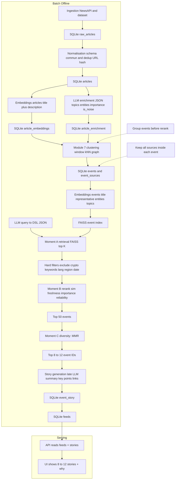

# Plan final simplifié (démo batch, open-source, Option 1 Retrieval)

Objectif : démo d’une plateforme qui transforme plein d’articles en **8–12 stories** (événements) réellement importantes pour l’utilisateur, avec exclusions (“pas de crypto”) et explications.

Hypothèses :
- **Traitement batch/offline** : pas de contrainte de latence, le feed est pré-calculé.
- **Open-source only** pour les modèles + infra ML (self-host sur GPU).
- **Stockage simple : SQLite**.
- Le texte utilisateur est converti en **DSL JSON** via un **LLM open-source** (query-to-DSL) avec validation.

---

## 1) Les 3 moments clés (A / B / C)

### Moment A — Retrieval = “je récupère des candidats”
But : passer de “tous les événements possibles” à une liste de candidats (ex : 300–1000) assez pertinente.
- Dans ce plan : **Option 1** = *retrieval par embeddings* + top-k (FAISS).
- Important : les contraintes “dures” type **pas de crypto** ne doivent pas dépendre de l’embedding → on les applique via filtres (tags/keywords) pilotés par le DSL.

### Moment B — Ranking/Reranking = “je classe finement”
But : réordonner les candidats et produire un top plus petit (ex : top 50), en combinant pertinence + fraîcheur + importance.
- Dans ce plan : reranking **simple** (heuristique) pour rester minimal en démo.

### Moment C — Feed final = “je sors 8–12 stories utiles”
But : sélectionner 8–12 items **diversifiés** et lisibles.
- Dans ce plan : diversité **MMR simple** (ou règles de quotas si tu veux plus simple encore).

---

## 2) Architecture globale (batch)

1. Ingestion articles (NewsAPI + dataset) → SQLite (raw)
2. Normalisation (schema commun) + nettoyage
3. Enrichissement LLM (tags, entités, importance) en batch GPU
4. Embeddings + index vecteur (FAISS)
5. Regroupement en événements (graph clustering simple par fenêtre)
6. Construction “event candidates” (sans résumé LLM) + embeddings events
7. Moment A : retrieval top-k (embeddings)
8. Moment B : ranking/reranking (scores simples)
9. Moment C : diversité + sélection 8–12
10. Génération story (LLM résumé + points clés + sources) seulement pour le top final
11. Matérialisation feed + stories dans SQLite
12. API/UI lit le feed pré-calculé

---

## 2.1 Diagramme Mermaid (Module 7 AVANT reranking)



---

## 3) Choix “les plus simples” par module

### Module 1 — Ingestion (NewsAPI + datasets)
**Choix simple** : scripts Python + cron/Task Scheduler.
- NewsAPI : fetch périodique (30–60 min) par thèmes/langues.
- Dataset : import CSV/JSON/Parquet (pandas/pyarrow) vers le même schema.

**Output** : table `raw_articles` (payload brut + url + source + date).

---

### Module 2 — Normalisation & nettoyage
**Choix simple** : fonctions de mapping + règles.
- Uniformiser champs : `title`, `description`, `content`, `published_at`, `source`, `language`, `url`.
- Dédoublonner : par `url` et/ou hash (title+source+date).

**Pourquoi** : tout le reste (LLM/embeddings/clustering) dépend d’un format stable.

---

### Module 3 — Enrichissement qualité (LLM)
**Choix simple** : 1 passage LLM instruct + sortie JSON validée.
- Sorties attendues :
  - `topics` (liste de tags d’une taxonomie fixe)
  - `entities` (ORG/PER/LOC)
  - `importance` (low/medium/high)
  - `is_noise` (bool) optionnel

**Modèles LLM (open-source)** : Qwen2.5 Instruct ou Mistral 7B Instruct.
**Inference simple** : llama.cpp (quantized) ou vLLM si VRAM OK.

**Output** : table `article_enrichment` (topics/entities/importance).

---

### Module 4 — Stockage (SQLite)
**Choix simple** : SQLite seul.
Tables minimales :
- `raw_articles`
- `articles` (normalisés)
- `article_enrichment`
- `article_embeddings`
- `events` (clusters)
- `event_sources` (liens vers articles)
- `event_story` (résumé/points)
- `feeds` (feed final par user/date)

---

### Module 5 — Embeddings + index vecteur (Option 1)
**Choix simple** : Sentence Transformers + FAISS.
- On calcule un embedding pour :
  - **événement/story** : `title + summary + entities + topics`
  - (optionnel) article : `title + description`

**Index** : FAISS (top-k) + mapping `vector_id -> event_id`.

---

### Module 6 — NLU (requête utilisateur)
**Choix (démo) : LLM query-to-DSL (open-source) + validation JSON**.

**Ce que ça fait** : transforme le texte utilisateur en un JSON structuré (le DSL) qui pilote les filtres et la requête de retrieval.

**Pourquoi c’est mieux qu’un NLU règles** : comprend mieux les formulations naturelles (“world changing”, “pas de crypto”, “priorité énergie Europe”, fenêtres temporelles).

**Garde-fous obligatoires** :
- sortie **JSON stricte**
- validation via JSON Schema (ou pydantic)
- fallback si invalide (règles minimales)

**Exemple de DSL attendu** :
```json
{
  "must_include": ["finance", "europe", "energie"],
  "must_exclude": ["crypto"],
  "time_window_hours": 168,
  "languages": ["fr", "en"],
  "regions": ["EU"],
  "importance": "high",
  "max_items": 12
}
```

**LLM open-source typique** : Qwen2.5 Instruct ou Mistral 7B Instruct (llama.cpp/vLLM).

---

### Module 7 — Regroupement par événements (graph clustering, fenêtre)
**Choix simple** : fenêtre temporelle + graph clustering minimal.
- Fenêtre : 72h ou 7 jours.
- kNN : pour chaque article, récupérer top 10–20 voisins via embeddings.
- Graphe : arête si cosine > seuil.
- Communautés : Louvain/Leiden.

**Output** : table `events` + liens vers articles.

---

### Module 8 — Génération des stories (résumé)
**Choix simple** : LLM résumé multi-sources, mais **le plus tard possible**.
- Quand : après Moment C (quand tu as déjà sélectionné 8–12 events) ou au minimum après Moment B.
- Pourquoi : éviter de résumer tout le dataset (coût GPU inutile) et garder une synthèse centrée sur ce qui sera réellement affiché.
- Input : 2–5 articles d’un event (titres + extraits) + liste des liens.
- Output : `event_story.title`, `event_story.summary`, `event_story.key_points`.

Garde-fou simple : “n’utiliser que les infos présentes dans les sources” + toujours lister les sources.

---

## 4) Moment A / B / C — Implémentation concrète

### Moment A (Retrieval) — Embeddings + filtres durs
Étapes :
1) **LLM → DSL** : transformer le texte user en JSON (extraction inclusions/exclusions, régions, langues, fenêtre, importance).
2) Construire un texte de requête à embedder (à partir du DSL) : ex “finance europe energie”.
3) Embedding requête via le même encodeur.
4) FAISS top-K (ex : K=500).
5) Filtrer *dur* (piloté par le DSL) :
  - enlever events taggés `crypto` (si `must_exclude` contient crypto)
  - enlever events contenant keywords crypto (safety net)
  - filtrer langue/région/date/fenêtre

Résultat : liste de candidats “propres” (ex : 200–400).

### Moment B (Ranking/Reranking) — Score simple (heuristique)
**Choix simple** : score = combinaison de signaux calculés.
Exemple :
- pertinence = similarité embedding
- fraîcheur = decay temporel
- importance = label LLM (low/med/high)
- fiabilité = score domaine (liste)

Tu calcules un score final et tu gardes top 50.

### Moment C (Feed final) — Diversité + top 8–12
**Choix simple** : MMR sur embeddings événements.
- Prendre 12 items qui maximisent pertinence et minimisent redondance.
- Variante encore plus simple : “max 2 stories par topic principal”.

Ensuite :
1) Générer les stories (résumé LLM) uniquement pour ces 8–12 events.
2) Écrire dans `feeds` le top 8–12 (et sauvegarder `event_story`).

---

## 5) Paramètres recommandés (démo)
- Fenêtre clustering : 7 jours
- FAISS top-K : 500 (puis filtres)
- Candidats après filtres : viser 200–400
- Rerank : top 50
- Feed final : 12

---

## 6) Ce que tu montres en démo (simple et convaincant)
- Input user : “finance europe énergie pas de crypto”
- Affichage : 12 stories (titre + résumé + sources)
- Bouton “Pourquoi je vois ça ?” :
  - match topics
  - exclusion respectée
  - fraîcheur
  - nombre de sources

---

## 7) Stack technique minimale
- Python (scripts batch) + FastAPI (serving)
- SQLite
- Sentence Transformers (embeddings)
- FAISS (index)
- Louvain/Leiden (graph clustering)
- LLM open-source (Qwen2.5/Mistral) via llama.cpp/vLLM
