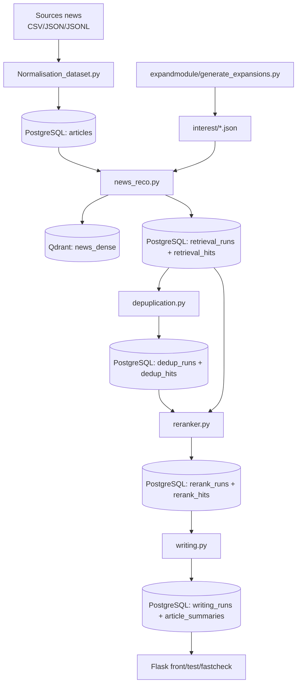

# Rapport d’Architecture — Dossier `main/`

_Date d’analyse : 2026-03-17_

## 1) Résumé exécutif

Le dossier `main/` implémente une **chaîne de traitement d’actualités orientée intérêts utilisateur**, organisée en 5 étages :

1. **Ingestion / Normalisation** des sources (CSV/JSON/JSONL) vers PostgreSQL (`articles`).
2. **Retrieval hybride** (dense Qdrant + BM25 local) piloté par intérêts et expansions.
3. **Déduplication** multi-étapes des résultats retrieval.
4. **Reranking LLM** (Qwen Reranker) avec post-traitement pairwise pour réduire la redondance sémantique.
5. **Writing** (Ollama) pour générer titre + résumé stockés en base.

La base technique est solide (pipeline explicite, persistance historisée, mécanismes de cache, séparation `*_core`/wrappers). En revanche, l’architecture montre des **points de dette** : duplication de code UI/scripts, conventions de nommage hétérogènes, imports dynamiques évitables, et quelques composants « dormants » (stage 3 dedup Qdrant non branché en prod).

---

## 2) Périmètre analysé

### 2.1 Modules cœur pipeline
- `main/news_reco_core.py`
- `main/reranker_core.py`
- `main/writing_core.py`
- `main/db.py`

### 2.2 Wrappers/CLI pipeline
- `main/news_reco.py`
- `main/depuplication.py`
- `main/reranker.py`
- `main/writing.py`

### 2.3 Orchestration et interfaces
- `main/orchestration/orchestration.py`
- `main/orchestration/orchestration copy.py`
- `main/front/app.py`, `main/front/save.py`
- `main/fastcheckrerank/app.py`, `main/fastcheckrerank/save.py`
- `main/test_hanna_css/app.py`

### 2.4 Outillage data / évaluation / expansion
- `main/ingestiontable/Normalisation_dataset.py`
- `main/ingestiontable/eval.py`
- `main/expandmodule/generate_expansions.py`

---

## 3) Vue d’ensemble de l’architecture

### 3.1 Style architectural
- **Pipeline batch orchestré par scripts CLI**, historisé dans PostgreSQL.
- **Core libraries + launchers** : la logique métier est principalement dans `*_core.py`; les wrappers ajoutent I/O, persistance et options CLI.
- **Architecture orientée “run tracking”** : chaque étape crée un `run_id` dédié, facilitant audit, replay partiel, et comparaison.

---

## 4) Architecture des données

## 4.1 Schéma PostgreSQL (`db.py`)

Tables principales :
- `articles` : corpus normalisé (source pivot).
- `retrieval_runs` / `retrieval_hits` : résultats de recherche hybride.
- `dedup_runs` / `dedup_hits` : résultats après suppression doublons.
- `rerank_runs` / `rerank_hits` : résultats rerankés.
- `writing_runs` / `article_summaries` : sorties rédactionnelles finales.

Points forts :
- Clés composées `(run_id, interest, rank)` cohérentes pour les hits.
- Historique complet par étape (traçabilité end-to-end).
- Champs JSONB `payload`, `raw_llm` pour conserver le contexte riche.

Points d’attention :
- Migration SQL embarquée dans `SCHEMA_SQL` (pratique, mais moins robuste qu’un système de migration dédié type Alembic).
- Colonne `summary_fr` conservée pour compatibilité alors que le contenu est désormais en anglais (dette sémantique).

---

## 5) Composants détaillés

## 5.1 Retrieval (dense + BM25)

### Modules
- Cœur : `news_reco_core.py`
- Runner DB : `news_reco.py`

### Rôle
- Charger le corpus (`articles`), dédupliquer, indexer/mettre à jour Qdrant, construire BM25 local.
- Exécuter la recherche multi-queries par intérêt (anchor + expansions + tags).
- Fusionner dense + lexical via **RRF pondéré**, puis rescoring final multi-features.

### Mécanique de scoring
- Candidats dense : Qdrant top-k par query spec.
- Candidats lexical : BM25 titre/description + body.
- Fusion intermédiaire : `weighted_rrf`.
- Features finales :
  - `s_rrf`
  - `s_dense_max`
  - `s_dense_cov`
  - `s_lex_max`
- Score final : combinaison linéaire pondérée (dominante dense + RRF).

### Points forts
- Bon compromis pertinence/rappel grâce à l’hybride.
- Caching local (articles + BM25) pour limiter le coût CPU/I/O.
- Mode `resume_index` Qdrant pour incrémental.

### Risques
- Dépendance forte à la qualité d’expansions.
- Sur-couplage à des hyperparamètres nombreux (top-k, caps, seuils) sans couche centralisée de config.

---

## 5.2 Déduplication

### Module
- `depuplication.py` (note: orthographe du fichier)

### Stratégie
Pipeline en 2 étapes actives :
1. **Simple duplicate** : même `article_id`/URL/fingerprint/titre+corps quasi-identiques.
2. **Near duplicate blocking** : shortlist par index de blocage lexical, puis RapidFuzz/Jaccard.

Une 3e étape existe dans le code :
- **Stage 3 Qdrant same-story** (`QdrantNeighborFinder`, `run_dedup_stage3_qdrant`) mais non branchée dans `main()` actuel.

### Points forts
- Bon ratio précision/coût avec blocking avant comparaisons lourdes.
- Raisons de rejet loguées par catégorie.

### Risques / dette
- Stage 3 non utilisé → complexité morte dans le module.
- Le script déduit les runs « latest par intérêt » (peut mixer des temporalités différentes selon contexte d’exécution).

---

## 5.3 Reranker

### Modules
- Cœur : `reranker_core.py`
- Runner DB : `reranker.py`

### Rôle
- Re-scoring LLM yes/no probabiliste (token logits yes/no) article vs intérêt.
- Post-traitement pairwise bidirectionnel pour réduire histoires quasi identiques.

### Détails clés
- Modèle par défaut : `Qwen/Qwen3-Reranker-4B`.
- Offload/mémoire : `device_map="auto"`, `max_memory` GPU+CPU, fallback CPU.
- Pairwise doc cleaning avancé (`_pairwise_denoise_body`) pour extraire un lead informatif.
- Sélection finale : stratégie gloutonne « keep if not same-story with kept set ».

### Points forts
- Contrôle robuste OOM/offload.
- Logique pairwise explicite, instrumentée, et paramétrable (threshold, dual-threshold, denoise).

### Risques
- Coût inference significatif (N×comparaisons pairwise).
- Variabilité de sortie dépendante du modèle et du prompt.

---

## 5.4 Writing (génération résumés/titres)

### Modules
- Cœur : `writing_core.py`
- Runner DB : `writing.py`

### Rôle
- Générer résumé et titre via Ollama, valider/assainir la sortie, persister dans `article_summaries`.
- Support de mode **repair** ciblé par `article_summary_id`.

### Robustesse implémentée
- Parsing défensif (JSON extraction + fallback ligne par ligne).
- Nettoyage anti-contamination (`<think>`, checklists, prompts reflétés, bullets).
- Validation de qualité (`is_usable_summary_output`, `is_usable_title_output`).
- Retry contrôlé (summary puis title, avec prompts de retry).

### Points d’attention
- Coexistence de deux styles : `writing_core.py` « legacy export fichiers » et `writing.py` « pipeline DB-first ».
- Indices de maintenance manuelle (bloc de code commenté conservé en fin de `writing.py`).

---

## 5.5 Persistance

### Module
- `db.py` (`PostgresStore`)

### Rôle
- Couche d’accès SQL unifiée pour toutes les étapes du pipeline.
- Initialisation schéma + CRUD/UPSERT des runs et hits.

### Appréciation
- API claire et orientée use-cases métier.
- Bonne centralisation SQL.
- Forte dépendance à SQL inline (lisible, mais difficile à versionner finement à grande échelle).

---

## 5.6 Orchestration et UI

### Orchestration
- `orchestration.py` enchaîne : expansion → retrieval → dedup → rerank → writing.
- Gestion explicite de VRAM (arrêt Ollama, `torch.cuda.empty_cache`) entre étapes.

### Fronts Flask
- `front/app.py`, `test_hanna_css/app.py`, `fastcheckrerank/*.py`.
- Fonction : déclencher pipeline par intérêt, afficher résumés stockés.

### Dette observable
- Duplication forte entre variantes `app.py` / `save.py` / dossiers UI.
- Secrets/config DB hardcodés dans plusieurs fichiers.

---

## 6) Dépendances techniques

## 6.1 Dépendances majeures
- **DB** : `psycopg`, `psycopg2` (coexistence selon module)
- **Vector DB** : `qdrant-client`
- **ML/NLP** : `torch`, `transformers`, `FlagEmbedding` ou `sentence-transformers`, `rank_bm25`, `rapidfuzz`
- **LLM serving** : `ollama` (HTTP API et CLI)
- **Web** : `flask`

## 6.2 Observation
- Mélange de clients PostgreSQL (`psycopg` v3 dans `db.py`, `psycopg2` dans fronts) → standardiser.

---

## 7) Flux opérationnel nominal

1. Normaliser et charger corpus dans `articles`.
2. Générer expansions d’intérêt (`expandmodule`).
3. Lancer retrieval (`news_reco.py`) → `retrieval_*`.
4. Lancer dédup (`depuplication.py`) → `dedup_*`.
5. Lancer rerank (`reranker.py`) → `rerank_*`.
6. Lancer writing (`writing.py`) → `writing_runs` + `article_summaries`.
7. Consommer via front Flask ou exports.

---

## 8) Qualité architecturale (évaluation)

## 8.1 Points solides
- Séparation claire des étapes métier.
- Traçabilité run-by-run en base.
- Mécanismes de fallback/résilience (backend embeddings, API Ollama, parsing LLM).
- Capacité de replay partiel de chaque étape.

## 8.2 Faiblesses structurantes
- Duplication de modules UI/scripts (risque divergence comportementale).
- Config dispersée et hardcodée (URLs, DB credentials, chemins venv).
- Imports dynamiques (`importlib.util`) dans wrappers alors que les modules sont locaux.
- Hétérogénéité de conventions (noms, langue commentaires, typo de fichier `depuplication.py`).

---

## 9) Risques techniques

1. **Risque opérationnel GPU/LLM** : contention VRAM entre Ollama et reranker.
2. **Risque de maintenance** : multiplicité de variantes UI et orchestration copy.
3. **Risque qualité data** : expansions non contrôlées peuvent dégrader retrieval.
4. **Risque cohérence sémantique** : colonne `summary_fr` contient de l’anglais.
5. **Risque de sécurité basique** : credentials DB en clair dans plusieurs fichiers.

---

## 10) Recommandations priorisées

## P0 (immédiat)
- Externaliser toute configuration (DB_URL, Qdrant URL, modèles, chemins) via `.env` + loader central.
- Éliminer les credentials hardcodés des interfaces Flask/orchestration.
- Choisir un seul client PostgreSQL (`psycopg` recommandé) et uniformiser.

## P1 (court terme)
- Consolider les fronts en **une seule application Flask**.
- Supprimer/archiver les scripts doublons (`orchestration copy.py`, `save.py` clones).
- Renommer `depuplication.py` en `deduplication.py` avec alias de compatibilité.
- Remplacer imports dynamiques des wrappers par imports standards package.

## P2 (moyen terme)
- Introduire migrations SQL versionnées (Alembic).
- Activer (ou retirer) proprement le Stage 3 dedup Qdrant.
- Créer un module `settings.py` typé (dataclass/pydantic) pour centraliser hyperparamètres.

## P3 (industrialisation)
- Ajouter observabilité (durées par étape, coût tokens, taux de retry, ratios de rejet).
- Ajouter tests d’intégration pipeline (smoke run retrieval→writing sur échantillon réduit).
- Packager les étapes en jobs orchestrables (Airflow/Prefect/Celery selon besoin).

---

## 11) Cible d’architecture recommandée (court/moyen terme)

- **Couche Core** : `retrieval_core`, `dedup_core`, `rerank_core`, `writing_core`.
- **Couche Adapters** : `postgres_adapter`, `qdrant_adapter`, `ollama_adapter`.
- **Couche Orchestration** : un orchestrateur unique (CLI + API).
- **Couche Presentation** : une seule app Flask propre (templates/static), sans SQL inline dispersé.
- **Couche Config** : fichier central + variables d’environnement.

Bénéfices attendus : lisibilité, fiabilité de prod, réduction du coût de maintenance, déploiement simplifié.

---

## 12) Conclusion

Le projet dispose déjà d’un **socle pipeline pertinent et fonctionnel** pour la recommandation d’actualités personnalisées. La valeur principale est la combinaison retrieval hybride + rerank LLM + writing, avec persistance historisée en base.

Le principal enjeu n’est plus la preuve de concept algorithmique, mais la **consolidation architecturale** : réduction des duplications, standardisation de la configuration et outillage de maintenance. Avec les actions P0/P1, la plateforme gagnera nettement en robustesse, sécurité opérationnelle et évolutivité.
